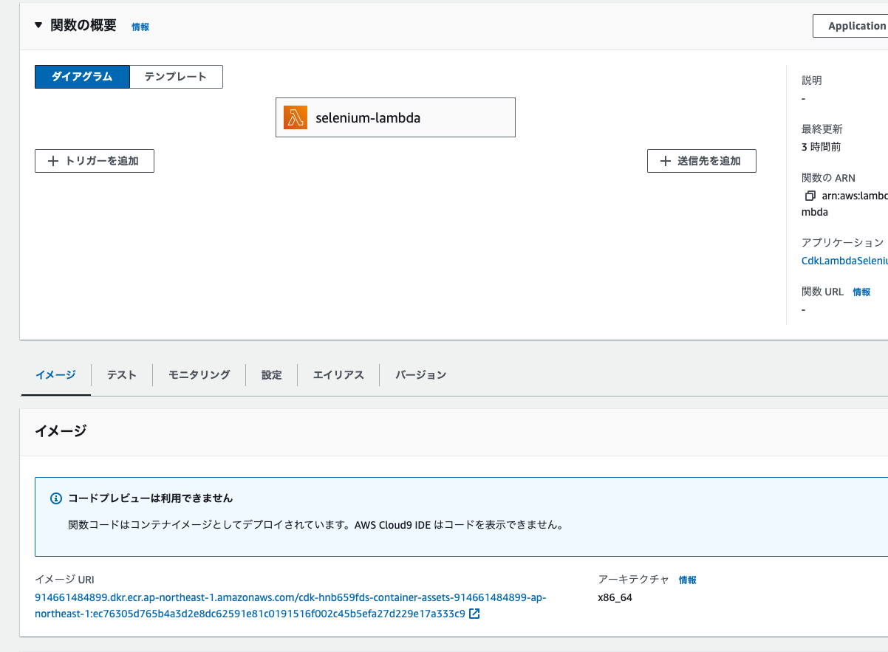
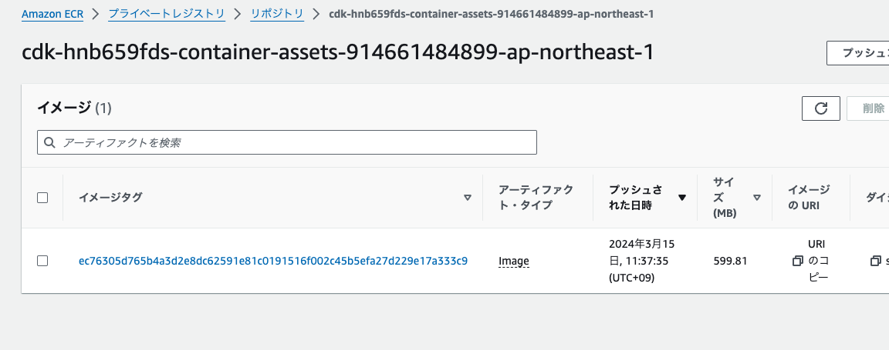
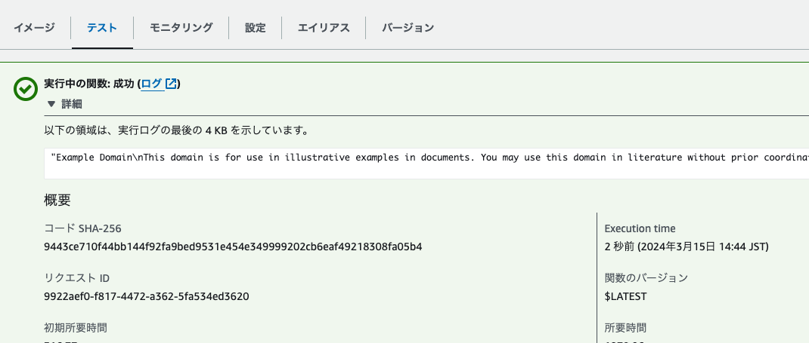

# LambdaでSeleniumを動かす構成をAWS CDKで実装する

## はじめに

最近 Lambda 上で Selenium を動かしていたのですが、Python3.12 へランタイムを上げたことで動作しなくなってしまいました。

これまでは Lambda レイヤーを使って chromedriver と headless-chromium をレイヤー化する方法を利用していました。

<iframe class="hatenablogcard" style="width:100%;height:155px;max-width:680px;" title="AWS Lambda PythonでSeleniumを使える環境を構築する | DevelopersIO" src="https://hatenablog-parts.com/embed?url=https://dev.classmethod.jp/articles/aws-lambda-python-selenium-make-env/" width="300" height="150" frameborder="0" scrolling="no"></iframe>

しかし Lambda のランタイムが変わると互換性の関係からうまくいかなくなります。

動作しなくなった原因は Selenium で利用する`chromedriver`や`headless-chromium`の互換性がないことです。ここが Lambda 上で Selenium を使う上で一番面倒なところです。新しいバージョンを使おうとしても、どのバージョンが正しく動作するのかが分かりません。

そこで、調べていたところ[docker-selenium-lambda](https://github.com/umihico/docker-selenium-lambda/tree/main)という Lambda 上で Selenium を動かすためのリポジトリがあったので参考にしてみます。

### どのような実装なのか

このリポジトリでは`chromedriver`や`headless-chromium`を Lambda のレイヤーで実装するのではなく、コンテナのイメージから Lambda を作成することで実装していました。

参考：[Lambda のコンテナイメージを使用する \- AWS Lambda](https://docs.aws.amazon.com/ja_jp/lambda/latest/dg/images-create.html)

そのため、Lambda レイヤーは必要なく代わりに Dockerfile を作成し ECR にイメージを保存しています。

この Dockerfile の中で Lambda のベースイメージと互換性のある`chromedriver`や`headless-chromium`、`Selenium`をダウンロードしていました。このイメージで指定されているバージョンをそのまま使えばいいようです。

元々のリポジトリでは SAM を使ったデプロイが行われていますが、私のプロジェクトでは CDK を利用しているため今回は CDK で実装してみます。

## コード構成

使用したコードは以下リポジトリに保存しています。

<iframe class="hatenablogcard" style="width:100%;height:155px;max-width:680px;" title="jun-suzuki1028/cdk-selenium-lambda" src="https://hatenablog-parts.com/embed?url=https://github.com/jun-suzuki1028/cdk-selenium-lambda" width="300" height="150" frameborder="0" scrolling="no"></iframe>

ディレクトリ構成は以下の通りです。

[bash]
.
├── README.md
├── app
│   ├── Dockerfile
│   └── main.py
├── bin
│   └── cdk-lambda-selenium.ts
├── lib
│   └── cdk-lambda-selenium-stack.ts
├── package-lock.json
├── package.json
├── cdk.json
├── jest.config.js
├── test
│   └── cdk-lambda-selenium.test.ts
└── tsconfig.json
[/bash]

### CDKのコード

今回実装するのは、Dockerfile から作成したイメージの保存とイメージを利用した Lambda の作成です。

[typescript title="./lib/cdk-lambda-selenium-stack.ts"]
import * as cdk from "aws-cdk-lib";
import { Construct } from "constructs";
import * as path from "path";

export class CdkLambdaSeleniumStack extends cdk.Stack {
  constructor(scope: Construct, id: string, props?: cdk.StackProps) {
    super(scope, id, props);

    const dockerImage = new cdk.aws_ecr_assets.DockerImageAsset(
      this,
      "SeleniumDockerImage",
      {
        directory: path.join(__dirname, "../", "app"),
      }
    );
    new cdk.aws_lambda.DockerImageFunction(this, "SeleniumLambda", {
      functionName: "selenium-lambda",
      code: cdk.aws_lambda.DockerImageCode.fromEcr(dockerImage.repository, {
        tagOrDigest: dockerImage.imageTag,
      }),
      memorySize: 2048,
      timeout: cdk.Duration.seconds(90),
    });
  }
}
[/typescript]

今回は ECR への push までいい感じにやって欲しかったので`aws_ecr_assets`のモジュールを利用しました。`DockerImageAsset`の引数で Dockerfile があるフォルダを指定すると、build から ECR リポジトリの作成、push までまとめてやってくれます。

Lambda は code の指定を`DockerImageCode.fromEcr`で push したイメージタグを指定します。

### Lambdaのコード

こちらは[docker-selenium-lambda](https://github.com/umihico/docker-selenium-lambda/tree/main)のコードをそのまま利用してます。動作確認だけであれば変更せずそのままで OK です。

[python title="./app/main.py"]
from selenium import webdriver
from tempfile import mkdtemp
from selenium.webdriver.common.by import By

def handler(event=None, context=None):
    options = webdriver.ChromeOptions()
    service = webdriver.ChromeService("/opt/chromedriver")

    options.binary_location = "/opt/chrome/chrome"
    options.add_argument("--headless=new")
    options.add_argument("--no-sandbox")
    options.add_argument("--disable-gpu")
    options.add_argument("--window-size=1280x1696")
    options.add_argument("--single-process")
    options.add_argument("--disable-dev-shm-usage")
    options.add_argument("--disable-dev-tools")
    options.add_argument("--no-zygote")
    options.add_argument(f"--user-data-dir={mkdtemp()}")
    options.add_argument(f"--data-path={mkdtemp()}")
    options.add_argument(f"--disk-cache-dir={mkdtemp()}")
    options.add_argument("--remote-debugging-port=9222")

    chrome = webdriver.Chrome(options=options, service=service)
    chrome.get("https://example.com/")

    return chrome.find_element(by=By.XPATH, value="//html").text
[/python]

### Dockerfile

こちらもほぼそのまま利用しています。私の実行環境が M1 Mac のため、イメージをダウンロードするところで、`--platform=linux/amd64`を追加しています。

[bash title="./app/Dockerfile"]
FROM --platform=linux/amd64 public.ecr.aws/lambda/python@sha256:1d922f123370801843aad18d0911759c55402af4d0dddb601181df4ed42b2ce2 as build
RUN dnf install -y unzip && \
    curl -Lo "/tmp/chromedriver-linux64.zip" "https://storage.googleapis.com/chrome-for-testing-public/122.0.6261.111/linux64/chromedriver-linux64.zip" && \
    curl -Lo "/tmp/chrome-linux64.zip" "https://storage.googleapis.com/chrome-for-testing-public/122.0.6261.111/linux64/chrome-linux64.zip" && \
    unzip /tmp/chromedriver-linux64.zip -d /opt/ && \
    unzip /tmp/chrome-linux64.zip -d /opt/

FROM --platform=linux/amd64 public.ecr.aws/lambda/python@sha256:1d922f123370801843aad18d0911759c55402af4d0dddb601181df4ed42b2ce2
RUN dnf install -y atk cups-libs gtk3 libXcomposite alsa-lib \
    libXcursor libXdamage libXext libXi libXrandr libXScrnSaver \
    libXtst pango at-spi2-atk libXt xorg-x11-server-Xvfb \
    xorg-x11-xauth dbus-glib dbus-glib-devel nss mesa-libgbm
RUN pip install selenium==4.18.1
COPY --from=build /opt/chrome-linux64 /opt/chrome
COPY --from=build /opt/chromedriver-linux64 /opt/
COPY main.py ./
CMD [ "main.handler" ]

[/bash]

## やってみる

それでは CDK をデプロイして動作確認してみます。Lambda を確認すると、イメージからデプロイされていることが表示されています。

イメージのリンクを開くと、ECR に保存されているイメージを確認できます。`aws_ecr_assets`を使っているため、リポジトリとイメージタグは CDK によって自動作成されています。

Lambda のテストを実行して成功していれば、Selenium が正しく動作しています。今回のサンプルコードでは`https://example.com/`を開いて表示されるテキストを取得しています。

無事 Lambda レイヤーを使わずイメージを使った Lambda で Selenium を実行できました。

## 終わりに

Lambda で Selenium を動かす構成を AWS CDK で実装してみました。`aws_ecr_assets`がコード量少なく ECR への push までサクッとやってくれるので非常に便利です。

今回はイメージ化して実装しましたが、Lambda をイメージにしなくても[docker-selenium-lambda](https://github.com/umihico/docker-selenium-lambda/tree/main)の Dockerfile を参考にレイヤーを作ることも可能だと思います。もしバージョンの互換性で悩んでいる場合は、参考にしてみてください。

## 参考
- [umihico/docker\-selenium\-lambda: The simplest demo of chrome automation by python and selenium in AWS Lambda](https://github.com/umihico/docker-selenium-lambda/tree/main)
- [Lambda のコンテナイメージを使用する \- AWS Lambda](https://docs.aws.amazon.com/ja_jp/lambda/latest/dg/images-create.html)
- [aws\-cdk\-lib\.aws\_ecr\_assets module · AWS CDK](https://docs.aws.amazon.com/cdk/api/v2/docs/aws-cdk-lib.aws_ecr_assets-readme.html)